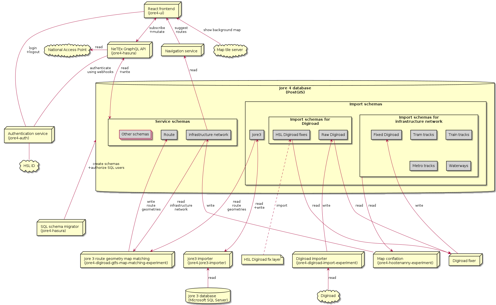

# Architecture

The architecture is in flux as we learn more about the design and requirements.

# Cloud infra

This section contains initial documentation about the cloud infra, especially with regards to network layout.

Note that the image below might be re-done completely since plant-uml has not proven to work well for this sort of diagram.

# Ports

This is the list of the ports used by different components in different environments.
- Local development: the port that is used when the component is spun up directly (e.g. nodejs or java)
- Docker container: the port that is exposed by the docker container of the component
- Kind cluster: the port that is exposed by a component when its docker container is run in a Kind cluster
- Azure (AKS): the port that is exposed by a component when its docker container is run in Azure AKS

| Component              | Local development | Docker container | Kind cluster.       | Azure (AKS)        |
| ---------------------- | -----------------:| ----------------:|--------------------:|-------------------:|
| jore4-ui               | 3000              | 80               | 3300 (`/*`)         | 443 (`/*`)         |
| jore4-auth             | 3001              | 8080             | TBD                 | TBD                |
| jore4-hasura           | 8080              | 8080             | 3300 (`/graphql/*`) | 443 (`/graphql/*`) |
| PSQL docker container  | 5432              | 5432             | 3002                | -                  |
| Azure PSQL             | -                 | -                | -                   | 5432 (bastion h.)  |

For local development, we are aiming to use these port spaces for different services:
- 3000 - 3099: development databases
- 3100 - 3199: test databases
- 3200 - 3299: API ports (hasura, REST, etc)
- 3300 - 3399: frontend ports (for browsers)

# Environments

The project setup can be run in the following types of environments:
- Kubernetes (AKS)
- Kubernetes in Docker (Kind)
- docker compose

The configurations for all environment types are generated from the same input yaml files using gomplate.

Several Kubernetes staging environments have been deployed in the Azure cloud ("playg", "dev", "test") in addition to the production ("prod") environment. The Kind environment type was created to be used in end-to-end-tests, but may be discontinued in the future. The docker compose environment type can be used locally when developing individual components and may in the future replace the Kind environment type in end-to-end-test scenarios.

For more information on the environment types and deployed environments, please see [the Jore4 flux repository README](https://github.com/HSLdevcom/jore4-flux/#readme).

# Routing/Map-matching architecture

