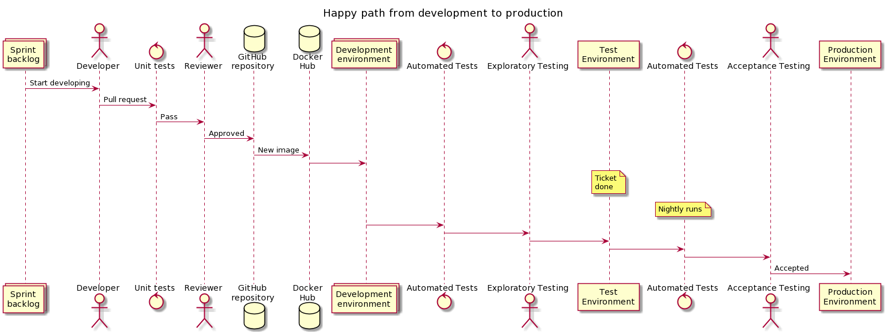

# CI/CD pipeline

*** Work in progress, document will be updated with details when parts of the pipeline are created ***

Description of our ci/cd pipeline
and how it is related to our testing strategy.

## Starting development
We should have bash scripts that can be used for setting up local environments.
So the developer can see and test his/her work easily.

## Pull request
After pull request is created:
  - new image is created in docker-hub
  - unit tests are run for new image
  - code review

## Deployment to development environment
After code passes review:
  - new development environment is created with kubernetes
  - automated tests are run
  - exploratory testing is done by someone who did not develop the feature

## Deployment to test environment
After exploratory testing is done,
and all related improvements/fixes are done and tested:
  - test environment is updated with new images that were used in development environment
    - this is prefarably done during the night
  - automated tests are run nightly and/or after new deployments
  - acceptance testing is done by customer

## Deploymenet to production environment
After new feature is accepted by customer, production environment is updated with the same
images that were used in test environment.
