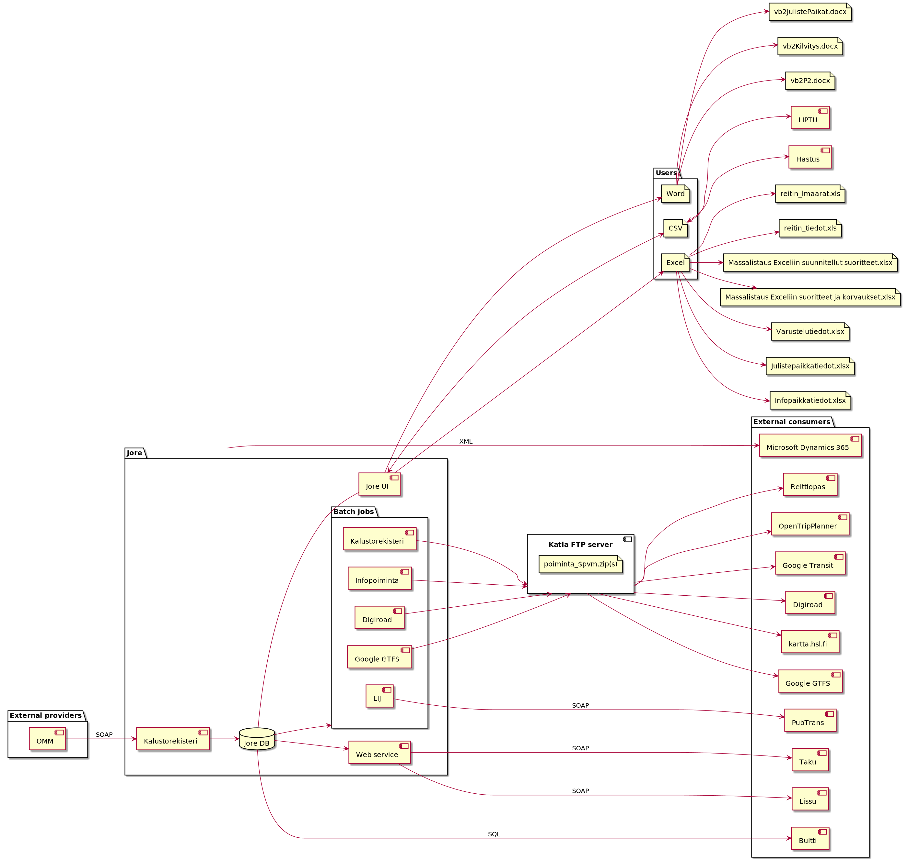

# Existing Jore 3 Integrations



## Document Import & Exports

Jore 3 offers several endpoints for importing & exporting data (e.g. CSV, Excel..) to external systems or use cases.

### HASTUS

[Hastus](https://www.giro.ca/en-ca/our-solutions/hastus-software/) is a separate timetable planning software.

#### Route API

Routes are uploaded to Hastus using a plain CSV file, which can be exported from Jore using the desktop UI.

```
Format: CSV
Contact: Ossi Berg
Data:
  - routes
  - stop places and distances between them
```

Sample:

```
...
rvpoint;4ROT;6.387;1;0;0;4920208;1091K2
place;1PRN;Puroniitty
stop;1600207;;Talosaarentie;Husövägen;Uusi Porvoontie;Nya Borgåvägen;;60.249545;25.164438;H5007
stpdist;1600207;1600209;1;696
...
```

#### Schedule API

Schedules are retrieved from Hastus using a plain CSV file, and imported to Jore using the desktop UI.

```
Format: CSV
Contact: Ossi Berg
Data:
  - vehicle schedules / "kaaviot"
    -- departure and arrival times
    -- "special days"
    -- stop place timing information
    -- vehicle assignments
```

Sample:

```
...
6;14731707;;4940297;;;;;0722;197.0;;
6;14731707;;4940204;;;;;0722;350.0;;
6;14731707;;4940206;;;;;0723;204.0;;
6;14731707;;4940208;;;;;0724;435.0;;
...
```

### Excel Exports

#### Route Usage Export

```
Filename: reitin_lmaarat.xls
Format: XLS
Contact: Ossi Berg, Natalia Berezina
Data:
  - ??
```

#### Route Lengths Export

```
Filename: reitin_tiedot.xls
Format: XLS
Contact: Natalia Berezina
Data:
  - ??
```

#### "Suunnitellut suoritteet" Export

```
Filename: "Massalistaus Exceliin suunnitellut suoritteet.xlsx"
Format: XLSX
Contact: Oskari Leho
Data:
  - ??
```

#### "Suoritteet ja korvaukset" Export

```
Filename: "Massalistaus Exceliin suoritteet ja korvaukset.xlsx"
Format: XLSX
Contact: Oskari Leho
Data:
  - ??
```

#### Bus Stop Equipment Export

```
Filename: "Varustelutiedot.xlsx"
Format: XLSX
Contact: Joona Packalén, Kari Lehtonen
Data:
  - ??
```

#### Poster Export for Terminals

```
Filename: "Julistepaikkatiedot.xlsx"
Format: XLSX
Contact: Joona Packalén
Data:
  - ??
```

#### "Infopaikka" Export

```
Filename: "Infopaikkatiedot.xlsx"
Format: XLSX
Contact: Joona Packalén
Data:
  - ??
```

#### Stop time export for a route Export

```
Filename: "valipisteajat.xlsx"
Format: XLSX
Contact: Ossi Berg
Data:
- ??
```

### Word Exports

#### Poster Installation Instructions Export for Terminals

```
Filename: "vb2JulistePaikat.docx"
Format: DOCX
Contact: Joona Packalén
Data:
  - ??
```

#### Plate Installation Instructions for Stop Places

```
Filename: "vb2Kilvitys.docx"
Format: DOCX
Contact: Joona Packalén
Data:
  - ??
```

## Database Batch Jobs

Several Jore 3 integrations are implemented as scheduled database batch jobs, which first extract the necessary data and then submit it further to the target integrations in various formats (e.g. to a FTP server or a web service API).

### Lippu- ja informaatiojärjestelmä (LIJ)

The LIJ integration is a web service integration based on the Hogia [Pubtrans](https://www.hogia.se/int/public-transport-system/solutions) WSDL schema.

```
Protocol: SOAP
Format: XML
Data:
  - ??
```

### Google GTFS

```
Format: Multiple CSV files on a ZIP, reference: https://developers.google.com/transit/gtfs 
Protocol: FTP?
Data: 
- Mostly according to specification. Sample dataset available in Drive. Sample from e.g. routes.txt
  ...
  route_id,agency_id,route_short_name,route_long_name,route_desc,route_type,route_url
1001,HSL,1,Eira - Töölö - Sörnäinen (M) - Käpylä,,0,http://aikataulut.hsl.fi/linjat/fi/h1_1a.html
1001H,HSL,1H,Käpylä - Koskelan halli,,0,http://aikataulut.hsl.fi/linjat/fi/h1_1a.html
1002,HSL,2,Olympiaterminaali - Töölö - Pasila as.,,0,http://aikataulut.hsl.fi/linjat/fi/h2.html
1002H,HSL,2H,Pasila as. - Töölön halli,,0,http://aikataulut.hsl.fi/linjat/fi/h2.html
...
```

### Infopoiminta

```
Format: Multiple DAT files in a zip
Protocol: FTP
Data:
  - Sample dataset available in Drive. For example reitti.dat:
  ...
  105041710504161001  12021071220211003Telakkakatu         0  1  0     0     0LKäpylä              Kottby              Rautatieas.         Järnvägsst.         0
 105041610604041001  12021071220211003Perämiehenkatu      0  2  251   251   0M                                                                                0
 106040410504081001  12021071220211003Eiran sairaala      1  3  341   592   0M                                                                                0
 105040810504131001  12021071220211003Viiskulma           2  4  312   904   0M                                                                                0
 105041310404011001  12021071220211003Iso Roobertinkatu   3  5  203   1107  0M                                                                                0
 104040110404371001  12021071220211003Fredrikinkatu       4  6  301   1408  0M                                                                                0
 104043710204631001  12021071220211003Erottaja            5  7  246   1654  0M                                                                                0
 102046310204531001  12021071220211003Ylioppilastalo      7  8  294   1948  0M                                                                                0
  ...
```

### Digiroad

```
Format: ??
Protocol: ??
Data:
  - ??
```

### Kalustorekisteri

```
Format: CSV in a ZIP
Protocol: FTP
Data:
  - Separate datasets for rail vehicles and buses. An example of buses:
  ...
   Nobina Finland Oy	1256	CPG-188	1.8.2021	D 	7	HSL-orans	8	BYD	14	BYD		1205	222	1
 Nobina Finland Oy	1255	CPG-187	1.8.2021	D 	7	HSL-orans	8	BYD	14	BYD		1205	222	1
 Nobina Finland Oy	1254	CPG-186	1.8.2021	D 	7	HSL-orans	8	BYD	14	BYD		1205	222	1
...
- For rail vehicles:
...
 VR Oy	25205	Eilf                                                      
 VR Oy	25208	Eilf                                                      
 HKL-Raitioliikenne	228	MLRV                                           
 HKL-Raitioliikenne	402	MLNRV3                                         

...
  ```

### HSL DW
```
Format: CSV in a ZIP
Protocol: FTP
Data:
- Includes information regarding vehicle tasks, contracts, stops and day types. For example pysakkityypit.csv:
 reitti	suunta	suuvoimast	suuviimpvm	soltunnus	tyyppi                                           
1001	1	4.10.2021	31.12.2050	1050417	1
1001	1	4.10.2021	31.12.2050	1050416	3
1001	1	4.10.2021	31.12.2050	1060404	3


  ```
  
### Jore History GraphQL Importer

Source code is available on [github](https://github.com/HSLdevcom/jore-history-graphql-import).

```
Format: ??
Protocol: ??
Data:
  - ??
```

## Direct Database integrations

Some Jore 3 integrations directly read data from the Jore database.

### Tarkastusmaksujärjestelmä TMJ

Uses train numbers and route codes from Jore3 table "jr_tmj"

### Bultti

Source code is available on [github](https://github.com/HSLdevcom/bultti), see e.g. the [Jore DB API](https://github.com/HSLdevcom/bultti/blob/master/src/jore/JoreDataSource.ts).

## Web Service integrations

Jore contains a web service interface (WSDL), which is used by some integrations to query data.

See `Jore_WS_Metodit.doc` document.

### Lissu

Lissu is an analysis toolkit. Deprecated, not in use.

```
Protocol: SOAP
Format: XML
Data:
  - "liikennemuototyypit"
  - routes
  - stop places
  - stop place usage statistics
```

### Taku

[Taku](https://www.crasman.fi/asiakkaat/hsl) is a page layout tool by [Crasman](https://www.crasman.fi/) used for designing physical timetable books.

```
Protocol: SOAP
Format: XML
Data:
  - Routes
  - Hastus places & bus stops
  - Timetables and charts
  - Equipments
```

## Other Integrations

### OMM (& Muuli)

Similar to LIJ, the OMM integration is based on the [Pubtrans](https://www.hogia.se/int/public-transport-system/solutions) web service. However, unlike LIJ, here Jore requests data from OMM.

Previously, a legacy system called _Muuli_ implemented this, but it was later replaced by OMM. Some Jore UI elements still refer to "OMM Muuli" when in fact they mean OMM.

```
Protocol: SOAP
Format: XML
Data:
  - vehicle journeys which were not run, "ajamattomat lähdöt"
```

### Microsoft Dynamics 365

Accounting information about journeys performed by public transport operators are stored in Microsoft Dynamics 365.

```
Format: XML
Protocol: ??
Data:
  - ??
```
